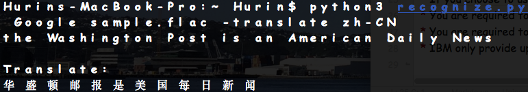

Audio to Text with google translate
____________________________________
This script is based on python, it can help you to convert audio to text and translate text to other language, it can apply to smart home such as voice recognition.

Install packages:
====================================
```
pip install SpeechRecognition
pip install --upgrade pocketsphinx
pip install googletrans
```

Start script
====================================
```
python3 recognize.py [method] [audio file] ([output file]/[-translate]) ([translate language])
```
This script include 5 different methods to recognize your audio to text, the error rates are different. All of them are supported .flac and .wav, .mp3 is not supported. File size has better less than 1M, otherwise some methods might not able to process due to connection lost. Method and audio file are required, output file and translation are optional.

Support method: Google, Bing, Wit, Houndify, Sphinx

Note: 	
* You can use google recognition with or without API Key(go to Google Developer Console, create a project, then go to Library on the right, find the Speech API, and enable it.)
* If you choose to use Google cloud, you need to register and pay through Google Speech API(https://cloud.google.com/speech/)
* You are required to get a key for Bing recognition. (https://azure.microsoft.com/en-us/try/cognitive-services/my-apis/) the key active for 30 days.
* You are required to get a key for Houndify. (https://www.houndify.com/dashboard) It is free to use up to 100 per day.
* IBM only provide up to 1000 mins for free trial, so it is not include in this script, you still can add it 'r.recognize_ibm(audio, username=IBM_USERNAME, password=IBM_PASSWORD)'

For example, if you have a record audio file named sample.flac, then you can input following command to convert audio and  print text on the screen:
```
python3 recognize.py Google sample.flac
```

If you want to save the convert text to file, you can input like this:
```
python3 recognize.py Google sample.flac output.txt
```

If you want to translate the audio to Simplified Chinese, you can input like this:
```
python3 recognize.py Google sample.flac -translate zh-CN
```
or 
```
python3 recognize.py Google sample.flac output.txt -translate zh-CN
```
If you don't specify the language, the default language is English.
